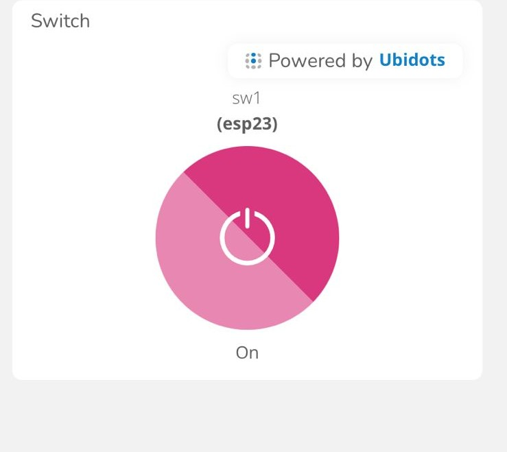
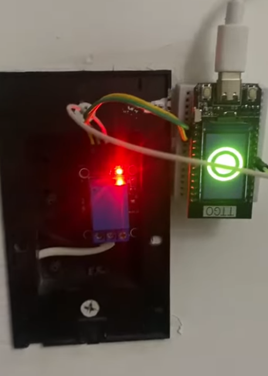

# Practica2_DisenoElectronico
Para esta practica sencillamente se implementó un circuito con la placa de desarrollo TTGO esp32 y un rele, el cual se activa de manera remota con un switch en la plataforma UBIDOTS.

  

Click en la siguiente imagen

Al final para hacer una mejor implementacion, se conectó el programa con el interruptor de un bombillo.
El codigo se presenta en el archivo codigo.md